# SciX Corpus Coverage Bias Analysis

> Generated 2026-04-20 from the live `scix` database. Re-run `scripts/coverage_bias_analysis.py` to refresh after further ingest.

This report analyzes the SciX corpus for coverage biases, data quality issues, and completeness across multiple dimensions. It compares the distribution of papers with full text (body IS NOT NULL) vs abstract-only papers and examines field-level data quality.

## Corpus Summary

- **Total papers**: 32,400,594
- **With full text**: 14,941,487 (46.1%)
- **Citation edges**: 299,329,159
- **Embeddings**: 32,423,531
- **Year range**: 1800 -- 2026
- **Median citation count**: 1
- **Median reference count**: 0

## Field Completeness (Missing Data Rates)

Shows what percentage of papers have non-null (and non-empty for arrays) values for each field.

| Field | Total | Populated | Missing | % Populated |
|---|---:|---:|---:|---:|
| title | 32,400,594 | 32,383,535 | 17,059 | 100.0% |
| abstract | 32,400,594 | 23,291,796 | 9,108,798 | 71.9% |
| body | 32,400,594 | 14,941,487 | 17,459,107 | 46.1% |
| year | 32,400,594 | 32,400,594 | 0 | 100.0% |
| doctype | 32,400,594 | 32,400,594 | 0 | 100.0% |
| pub | 32,400,594 | 32,400,485 | 109 | 100.0% |
| first_author | 32,400,594 | 31,214,062 | 1,186,532 | 96.3% |
| citation_count | 32,400,594 | 32,399,050 | 1,544 | 100.0% |
| read_count | 32,400,594 | 32,399,048 | 1,546 | 100.0% |
| reference_count | 32,400,594 | 27,400,705 | 4,999,889 | 84.6% |
| pubdate | 32,400,594 | 32,400,590 | 4 | 100.0% |
| lang | 32,400,594 | 0 | 32,400,594 | 0.0% |
| copyright | 32,400,594 | 15,556,018 | 16,844,576 | 48.0% |
| authors | 32,400,594 | 31,214,062 | 1,186,532 | 96.3% |
| affiliations | 32,400,594 | 31,231,774 | 1,168,820 | 96.4% |
| keywords | 32,400,594 | 15,839,773 | 16,560,821 | 48.9% |
| arxiv_class | 32,400,594 | 2,672,557 | 29,728,037 | 8.2% |
| database | 32,400,594 | 32,400,590 | 4 | 100.0% |
| doi | 32,400,594 | 28,241,853 | 4,158,741 | 87.2% |
| bibstem | 32,400,594 | 32,400,590 | 4 | 100.0% |
| bibgroup | 32,400,594 | 663,074 | 31,737,520 | 2.0% |
| orcid_pub | 32,400,594 | 31,184,320 | 1,216,274 | 96.2% |
| orcid_user | 32,400,594 | 397,815 | 32,002,779 | 1.2% |

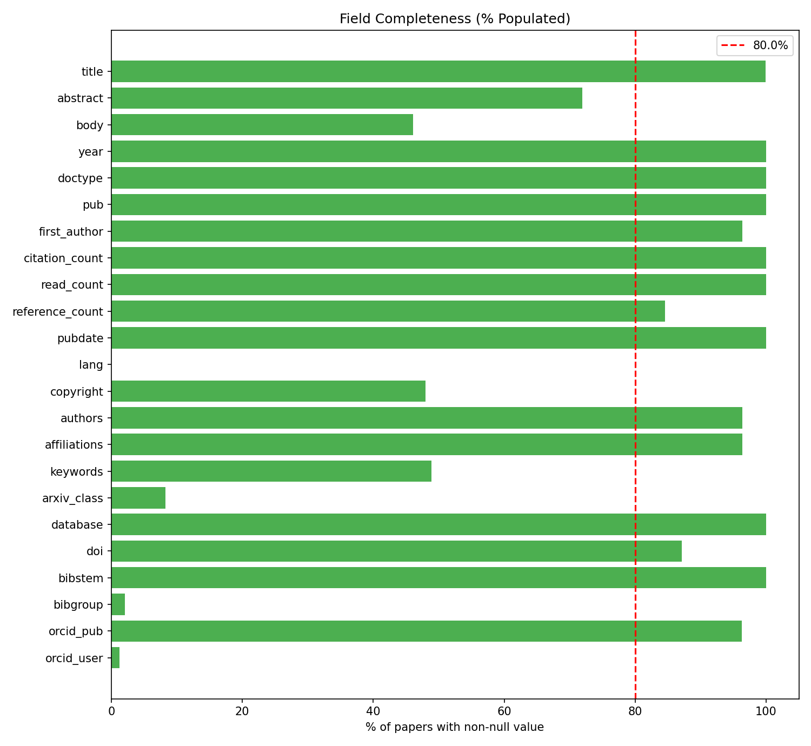

## Citation Network Completeness

Measures what fraction of cited papers (targets of citation edges) exist in the corpus.

- **Total citation edges**: 299,329,159
- **Edges with target in corpus**: 297,946,258 (99.5%)
- **Edges with target missing**: 1,382,901 (0.5%)
- **Unique cited papers**: 286,443,039
- **Unique cited in corpus**: 285,072,111 (99.5%)
- **Unique cited missing**: 1,370,928 (0.5%)

## Year Distribution

| Year | Total | Full Text | Abstract Only | % Full Text |
|---|---:|---:|---:|---:|
| 1800 | 208 | 0 | 208 | 0.0% |
| 1801 | 162 | 0 | 162 | 0.0% |
| 1802 | 143 | 0 | 143 | 0.0% |
| 1803 | 228 | 0 | 228 | 0.0% |
| 1804 | 177 | 0 | 177 | 0.0% |
| 1805 | 194 | 4 | 190 | 2.1% |
| 1806 | 195 | 9 | 186 | 4.6% |
| 1807 | 151 | 5 | 146 | 3.3% |
| 1808 | 178 | 3 | 175 | 1.7% |
| 1809 | 206 | 4 | 202 | 1.9% |
| 1810 | 161 | 8 | 153 | 5.0% |
| 1811 | 205 | 34 | 171 | 16.6% |
| 1812 | 171 | 0 | 171 | 0.0% |
| 1813 | 170 | 0 | 170 | 0.0% |
| 1814 | 165 | 0 | 165 | 0.0% |
| 1815 | 199 | 45 | 154 | 22.6% |
| 1816 | 159 | 0 | 159 | 0.0% |
| 1817 | 169 | 10 | 159 | 5.9% |
| 1818 | 239 | 18 | 221 | 7.5% |
| 1819 | 159 | 0 | 159 | 0.0% |
| 1820 | 211 | 20 | 191 | 9.5% |
| 1821 | 253 | 24 | 229 | 9.5% |
| 1822 | 437 | 186 | 251 | 42.6% |
| 1823 | 362 | 150 | 212 | 41.4% |
| 1824 | 401 | 235 | 166 | 58.6% |
| 1825 | 388 | 217 | 171 | 55.9% |
| 1826 | 597 | 238 | 359 | 39.9% |
| 1827 | 519 | 186 | 333 | 35.8% |
| 1828 | 680 | 151 | 529 | 22.2% |
| 1829 | 527 | 158 | 369 | 30.0% |
| 1830 | 877 | 190 | 687 | 21.7% |
| 1831 | 432 | 186 | 246 | 43.1% |
| 1832 | 470 | 197 | 273 | 41.9% |
| 1833 | 540 | 214 | 326 | 39.6% |
| 1834 | 536 | 172 | 364 | 32.1% |
| 1835 | 644 | 294 | 350 | 45.6% |
| 1836 | 611 | 247 | 364 | 40.4% |
| 1837 | 785 | 129 | 656 | 16.4% |
| 1838 | 549 | 167 | 382 | 30.4% |
| 1839 | 625 | 152 | 473 | 24.3% |
| 1840 | 631 | 224 | 407 | 35.5% |
| 1841 | 490 | 142 | 348 | 29.0% |
| 1842 | 743 | 306 | 437 | 41.2% |
| 1843 | 924 | 264 | 660 | 28.6% |
| 1844 | 691 | 352 | 339 | 50.9% |
| 1845 | 758 | 343 | 415 | 45.2% |
| 1846 | 840 | 416 | 424 | 49.5% |
| 1847 | 930 | 474 | 456 | 51.0% |
| 1848 | 901 | 458 | 443 | 50.8% |
| 1849 | 1,137 | 616 | 521 | 54.2% |
| 1850 | 1,184 | 606 | 578 | 51.2% |
| 1851 | 1,518 | 611 | 907 | 40.2% |
| 1852 | 1,465 | 609 | 856 | 41.6% |
| 1853 | 1,455 | 531 | 924 | 36.5% |
| 1854 | 1,667 | 568 | 1,099 | 34.1% |
| 1855 | 1,817 | 534 | 1,283 | 29.4% |
| 1856 | 1,870 | 560 | 1,310 | 29.9% |
| 1857 | 2,184 | 715 | 1,469 | 32.7% |
| 1858 | 1,734 | 642 | 1,092 | 37.0% |
| 1859 | 2,019 | 658 | 1,361 | 32.6% |
| 1860 | 2,000 | 668 | 1,332 | 33.4% |
| 1861 | 1,832 | 702 | 1,130 | 38.3% |
| 1862 | 1,960 | 728 | 1,232 | 37.1% |
| 1863 | 2,003 | 799 | 1,204 | 39.9% |
| 1864 | 1,639 | 530 | 1,109 | 32.3% |
| 1865 | 2,001 | 704 | 1,297 | 35.2% |
| 1866 | 2,131 | 802 | 1,329 | 37.6% |
| 1867 | 2,245 | 624 | 1,621 | 27.8% |
| 1868 | 2,092 | 718 | 1,374 | 34.3% |
| 1869 | 2,341 | 488 | 1,853 | 20.9% |
| 1870 | 3,339 | 619 | 2,720 | 18.5% |
| 1871 | 3,485 | 506 | 2,979 | 14.5% |
| 1872 | 3,350 | 779 | 2,571 | 23.2% |
| 1873 | 3,562 | 990 | 2,572 | 27.8% |
| 1874 | 3,705 | 1,079 | 2,626 | 29.1% |
| 1875 | 3,444 | 849 | 2,595 | 24.6% |
| 1876 | 3,502 | 658 | 2,844 | 18.8% |
| 1877 | 4,072 | 902 | 3,170 | 22.1% |
| 1878 | 4,061 | 776 | 3,285 | 19.1% |
| 1879 | 4,782 | 1,022 | 3,760 | 21.4% |
| 1880 | 4,935 | 1,053 | 3,882 | 21.3% |
| 1881 | 5,160 | 1,043 | 4,117 | 20.2% |
| 1882 | 4,789 | 1,291 | 3,498 | 27.0% |
| 1883 | 5,617 | 1,324 | 4,293 | 23.6% |
| 1884 | 5,996 | 1,535 | 4,461 | 25.6% |
| 1885 | 5,743 | 1,422 | 4,321 | 24.8% |
| 1886 | 6,000 | 1,669 | 4,331 | 27.8% |
| 1887 | 5,863 | 1,691 | 4,172 | 28.8% |
| 1888 | 6,072 | 1,569 | 4,503 | 25.8% |
| 1889 | 6,780 | 1,785 | 4,995 | 26.3% |
| 1890 | 6,402 | 1,540 | 4,862 | 24.1% |
| 1891 | 6,638 | 2,052 | 4,586 | 30.9% |
| 1892 | 6,482 | 1,526 | 4,956 | 23.5% |
| 1893 | 7,123 | 1,905 | 5,218 | 26.7% |
| 1894 | 6,863 | 1,968 | 4,895 | 28.7% |
| 1895 | 7,269 | 1,887 | 5,382 | 26.0% |
| 1896 | 8,001 | 2,268 | 5,733 | 28.4% |
| 1897 | 7,887 | 2,070 | 5,817 | 26.2% |
| 1898 | 8,470 | 2,461 | 6,009 | 29.1% |
| 1899 | 8,733 | 2,033 | 6,700 | 23.3% |
| 1900 | 8,280 | 2,265 | 6,015 | 27.4% |
| 1901 | 7,676 | 1,997 | 5,679 | 26.0% |
| 1902 | 8,671 | 2,139 | 6,532 | 24.7% |
| 1903 | 9,784 | 2,300 | 7,484 | 23.5% |
| 1904 | 9,480 | 2,709 | 6,771 | 28.6% |
| 1905 | 9,411 | 2,334 | 7,077 | 24.8% |
| 1906 | 9,632 | 2,501 | 7,131 | 26.0% |
| 1907 | 9,629 | 2,255 | 7,374 | 23.4% |
| 1908 | 9,911 | 2,620 | 7,291 | 26.4% |
| 1909 | 10,397 | 2,530 | 7,867 | 24.3% |
| 1910 | 11,274 | 2,613 | 8,661 | 23.2% |
| 1911 | 11,856 | 2,527 | 9,329 | 21.3% |
| 1912 | 10,882 | 2,348 | 8,534 | 21.6% |
| 1913 | 11,729 | 2,300 | 9,429 | 19.6% |
| 1914 | 11,124 | 2,339 | 8,785 | 21.0% |
| 1915 | 10,502 | 1,917 | 8,585 | 18.2% |
| 1916 | 11,044 | 2,187 | 8,857 | 19.8% |
| 1917 | 9,903 | 2,011 | 7,892 | 20.3% |
| 1918 | 9,933 | 1,985 | 7,948 | 20.0% |
| 1919 | 10,735 | 1,953 | 8,782 | 18.2% |
| 1920 | 12,345 | 2,188 | 10,157 | 17.7% |
| 1921 | 13,123 | 2,001 | 11,122 | 15.2% |
| 1922 | 14,755 | 2,810 | 11,945 | 19.0% |
| 1923 | 14,637 | 2,550 | 12,087 | 17.4% |
| 1924 | 15,861 | 2,714 | 13,147 | 17.1% |
| 1925 | 15,991 | 2,255 | 13,736 | 14.1% |
| 1926 | 17,296 | 2,242 | 15,054 | 13.0% |
| 1927 | 17,764 | 2,933 | 14,831 | 16.5% |
| 1928 | 17,635 | 2,445 | 15,190 | 13.9% |
| 1929 | 18,436 | 2,762 | 15,674 | 15.0% |
| 1930 | 20,403 | 3,227 | 17,176 | 15.8% |
| 1931 | 19,607 | 3,076 | 16,531 | 15.7% |
| 1932 | 20,657 | 3,230 | 17,427 | 15.6% |
| 1933 | 21,417 | 3,320 | 18,097 | 15.5% |
| 1934 | 20,632 | 3,258 | 17,374 | 15.8% |
| 1935 | 21,062 | 3,100 | 17,962 | 14.7% |
| 1936 | 21,148 | 3,107 | 18,041 | 14.7% |
| 1937 | 21,207 | 3,126 | 18,081 | 14.7% |
| 1938 | 21,352 | 3,247 | 18,105 | 15.2% |
| 1939 | 21,127 | 3,172 | 17,955 | 15.0% |
| 1940 | 18,861 | 2,622 | 16,239 | 13.9% |
| 1941 | 17,772 | 2,256 | 15,516 | 12.7% |
| 1942 | 16,381 | 2,082 | 14,299 | 12.7% |
| 1943 | 14,932 | 1,773 | 13,159 | 11.9% |
| 1944 | 13,900 | 1,414 | 12,486 | 10.2% |
| 1945 | 13,066 | 1,408 | 11,658 | 10.8% |
| 1946 | 16,573 | 2,553 | 14,020 | 15.4% |
| 1947 | 18,910 | 2,619 | 16,291 | 13.8% |
| 1948 | 23,423 | 3,101 | 20,322 | 13.2% |
| 1949 | 25,899 | 3,522 | 22,377 | 13.6% |
| 1950 | 29,091 | 3,873 | 25,218 | 13.3% |
| 1951 | 31,466 | 4,030 | 27,436 | 12.8% |
| 1952 | 31,967 | 3,776 | 28,191 | 11.8% |
| 1953 | 34,722 | 4,111 | 30,611 | 11.8% |
| 1954 | 37,109 | 4,257 | 32,852 | 11.5% |
| 1955 | 38,740 | 4,447 | 34,293 | 11.5% |
| 1956 | 41,583 | 4,249 | 37,334 | 10.2% |
| 1957 | 43,032 | 4,594 | 38,438 | 10.7% |
| 1958 | 47,142 | 5,193 | 41,949 | 11.0% |
| 1959 | 50,157 | 5,517 | 44,640 | 11.0% |
| 1960 | 54,257 | 5,704 | 48,553 | 10.5% |
| 1961 | 57,141 | 6,621 | 50,520 | 11.6% |
| 1962 | 64,154 | 7,283 | 56,871 | 11.3% |
| 1963 | 71,296 | 7,944 | 63,352 | 11.1% |
| 1964 | 76,951 | 9,172 | 67,779 | 11.9% |
| 1965 | 86,500 | 10,391 | 76,109 | 12.0% |
| 1966 | 94,872 | 11,477 | 83,395 | 12.1% |
| 1967 | 102,875 | 16,916 | 85,959 | 16.4% |
| 1968 | 107,914 | 18,875 | 89,039 | 17.5% |
| 1969 | 118,695 | 20,838 | 97,857 | 17.6% |
| 1970 | 124,100 | 23,896 | 100,204 | 19.3% |
| 1971 | 129,689 | 26,099 | 103,590 | 20.1% |
| 1972 | 137,301 | 27,656 | 109,645 | 20.1% |
| 1973 | 142,095 | 29,328 | 112,767 | 20.6% |
| 1974 | 154,665 | 29,229 | 125,436 | 18.9% |
| 1975 | 171,551 | 30,971 | 140,580 | 18.1% |
| 1976 | 174,999 | 32,663 | 142,336 | 18.7% |
| 1977 | 182,596 | 34,154 | 148,442 | 18.7% |
| 1978 | 185,731 | 34,099 | 151,632 | 18.4% |
| 1979 | 197,450 | 37,312 | 160,138 | 18.9% |
| 1980 | 201,442 | 38,795 | 162,647 | 19.3% |
| 1981 | 212,143 | 41,164 | 170,979 | 19.4% |
| 1982 | 211,155 | 40,269 | 170,886 | 19.1% |
| 1983 | 220,566 | 44,085 | 176,481 | 20.0% |
| 1984 | 229,557 | 46,207 | 183,350 | 20.1% |
| 1985 | 238,595 | 48,338 | 190,257 | 20.3% |
| 1986 | 244,093 | 51,648 | 192,445 | 21.2% |
| 1987 | 257,988 | 54,926 | 203,062 | 21.3% |
| 1988 | 273,223 | 58,759 | 214,464 | 21.5% |
| 1989 | 290,632 | 63,735 | 226,897 | 21.9% |
| 1990 | 305,110 | 66,090 | 239,020 | 21.7% |
| 1991 | 325,937 | 68,912 | 257,025 | 21.1% |
| 1992 | 334,229 | 71,484 | 262,745 | 21.4% |
| 1993 | 354,735 | 76,888 | 277,847 | 21.7% |
| 1994 | 365,765 | 79,719 | 286,046 | 21.8% |
| 1995 | 364,430 | 83,043 | 281,387 | 22.8% |
| 1996 | 389,821 | 87,851 | 301,970 | 22.5% |
| 1997 | 398,511 | 92,543 | 305,968 | 23.2% |
| 1998 | 415,696 | 104,393 | 311,303 | 25.1% |
| 1999 | 421,046 | 111,612 | 309,434 | 26.5% |
| 2000 | 441,961 | 119,273 | 322,688 | 27.0% |
| 2001 | 464,795 | 141,716 | 323,079 | 30.5% |
| 2002 | 496,501 | 149,312 | 347,189 | 30.1% |
| 2003 | 536,741 | 169,515 | 367,226 | 31.6% |
| 2004 | 564,017 | 192,735 | 371,282 | 34.2% |
| 2005 | 605,808 | 315,011 | 290,797 | 52.0% |
| 2006 | 664,516 | 355,568 | 308,948 | 53.5% |
| 2007 | 702,395 | 383,639 | 318,756 | 54.6% |
| 2008 | 765,483 | 417,742 | 347,741 | 54.6% |
| 2009 | 845,013 | 447,769 | 397,244 | 53.0% |
| 2010 | 886,430 | 479,009 | 407,421 | 54.0% |
| 2011 | 901,863 | 494,776 | 407,087 | 54.9% |
| 2012 | 937,657 | 511,225 | 426,432 | 54.5% |
| 2013 | 952,280 | 548,265 | 404,015 | 57.6% |
| 2014 | 984,111 | 577,000 | 407,111 | 58.6% |
| 2015 | 1,032,535 | 611,581 | 420,954 | 59.2% |
| 2016 | 1,090,059 | 657,230 | 432,829 | 60.3% |
| 2017 | 1,127,588 | 682,999 | 444,589 | 60.6% |
| 2018 | 1,199,985 | 790,214 | 409,771 | 65.8% |
| 2019 | 1,300,139 | 895,333 | 404,806 | 68.9% |
| 2020 | 1,042,047 | 730,762 | 311,285 | 70.1% |
| 2021 | 1,106,362 | 706,335 | 400,027 | 63.8% |
| 2022 | 1,109,001 | 701,015 | 407,986 | 63.2% |
| 2023 | 1,133,541 | 720,074 | 413,467 | 63.5% |
| 2024 | 1,219,453 | 817,568 | 401,885 | 67.0% |
| 2025 | 430,065 | 332,266 | 97,799 | 77.3% |
| 2026 | 10,298 | 10,159 | 139 | 98.7% |

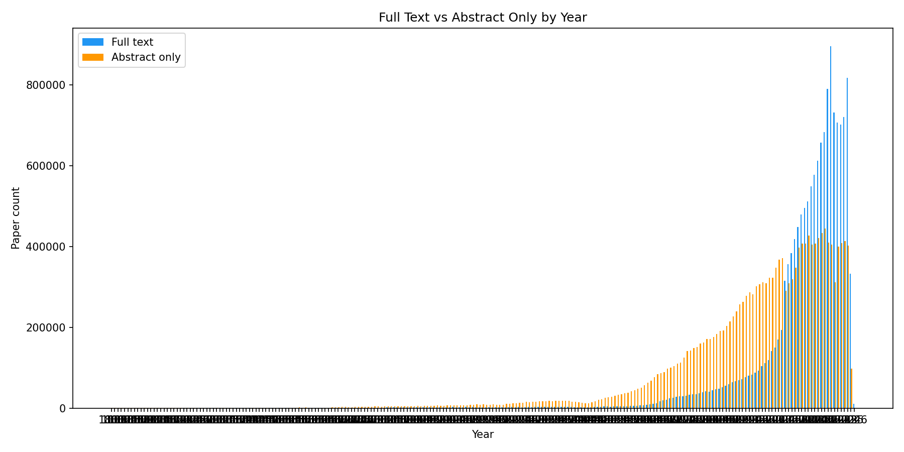

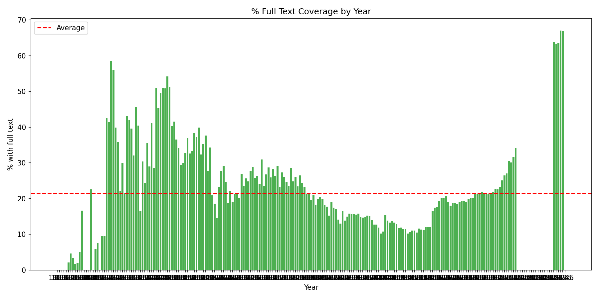

## arXiv Class Distribution (Top 20)

| arXiv Class | Total | Full Text | Abstract Only | % Full Text |
|---|---:|---:|---:|---:|
| cs.LG | 198,807 | 197,077 | 1,730 | 99.1% |
| hep-ph | 185,595 | 182,713 | 2,882 | 98.5% |
| hep-th | 171,068 | 168,605 | 2,463 | 98.6% |
| quant-ph | 158,726 | 156,881 | 1,845 | 98.8% |
| cs.CV | 148,677 | 147,407 | 1,270 | 99.2% |
| cs.AI | 121,917 | 120,413 | 1,504 | 98.8% |
| gr-qc | 112,194 | 110,371 | 1,823 | 98.4% |
| astro-ph | 105,263 | 104,699 | 564 | 99.5% |
| cond-mat.mtrl-sci | 97,429 | 96,669 | 760 | 99.2% |
| cond-mat.mes-hall | 93,632 | 93,022 | 610 | 99.3% |
| math-ph | 82,447 | 81,696 | 751 | 99.1% |
| cs.CL | 80,839 | 80,104 | 735 | 99.1% |
| cond-mat.str-el | 76,626 | 76,132 | 494 | 99.4% |
| cond-mat.stat-mech | 75,798 | 75,275 | 523 | 99.3% |
| stat.ML | 74,038 | 73,295 | 743 | 99.0% |
| astro-ph.CO | 71,112 | 69,476 | 1,636 | 97.7% |
| astro-ph.GA | 69,527 | 69,127 | 400 | 99.4% |
| math.CO | 69,333 | 68,677 | 656 | 99.0% |
| math.AP | 65,331 | 64,683 | 648 | 99.0% |
| astro-ph.SR | 63,810 | 63,506 | 304 | 99.5% |

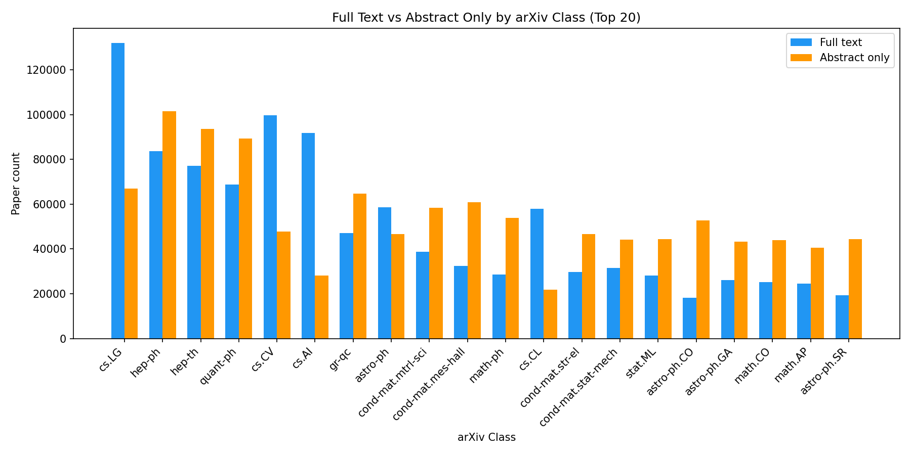

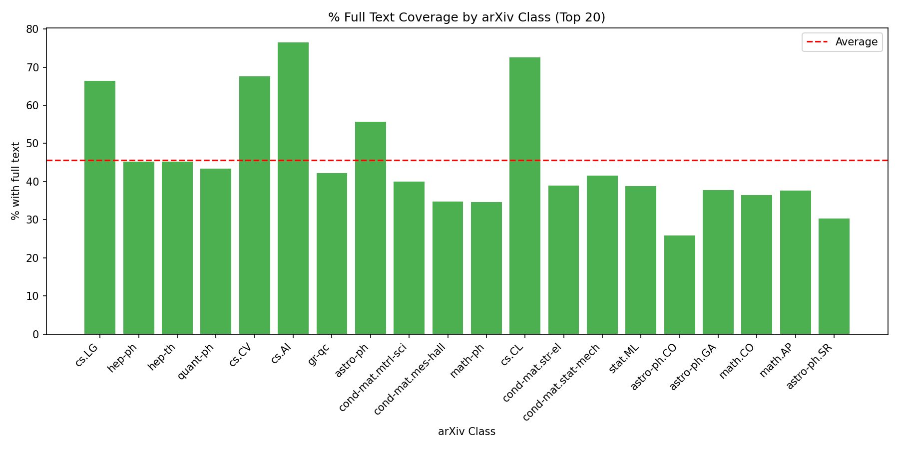

## Document Type Distribution

| Doctype | Total | Full Text | Abstract Only | % Full Text |
|---|---:|---:|---:|---:|
| article | 21,943,650 | 10,029,447 | 11,914,203 | 45.7% |
| inproceedings | 5,602,616 | 3,141,694 | 2,460,922 | 56.1% |
| eprint | 1,599,754 | 1,553,078 | 46,676 | 97.1% |
| abstract | 1,376,088 | 87,835 | 1,288,253 | 6.4% |
| proposal | 474,978 | 0 | 474,978 | 0.0% |
| techreport | 332,016 | 617 | 331,399 | 0.2% |
| phdthesis | 219,380 | 1,880 | 217,500 | 0.9% |
| circular | 166,524 | 2,187 | 164,337 | 1.3% |
| inbook | 129,975 | 12,276 | 117,699 | 9.4% |
| bookreview | 110,939 | 36,934 | 74,005 | 33.3% |
| proceedings | 86,731 | 3,487 | 83,244 | 4.0% |
| erratum | 71,954 | 36,825 | 35,129 | 51.2% |
| book | 67,763 | 258 | 67,505 | 0.4% |
| editorial | 60,889 | 28,675 | 32,214 | 47.1% |
| dataset | 43,260 | 3 | 43,257 | 0.0% |
| newsletter | 42,802 | 438 | 42,364 | 1.0% |
| software | 36,995 | 7 | 36,988 | 0.0% |
| mastersthesis | 10,595 | 18 | 10,577 | 0.2% |
| obituary | 10,095 | 4,363 | 5,732 | 43.2% |
| misc | 8,054 | 1,464 | 6,590 | 18.2% |
| pressrelease | 2,960 | 0 | 2,960 | 0.0% |
| catalog | 2,230 | 1 | 2,229 | 0.0% |
| talk | 339 | 0 | 339 | 0.0% |
| service | 7 | 0 | 7 | 0.0% |

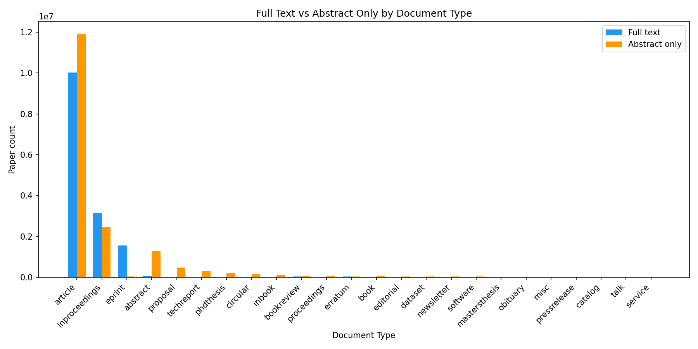

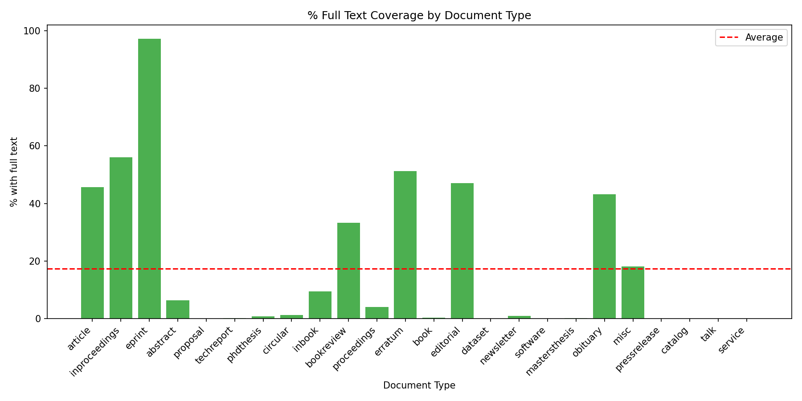

## Database (Discipline) Distribution

The ADS `database` field indicates which databases index a paper (e.g. astronomy, physics, general). Papers may appear in multiple databases.

| Database | Total | Full Text | Abstract Only | % Full Text |
|---|---:|---:|---:|---:|
| physics | 17,093,196 | 7,960,783 | 9,132,413 | 46.6% |
| earth science | 13,118,876 | 6,475,688 | 6,643,188 | 49.4% |
| general | 5,791,687 | 2,482,004 | 3,309,683 | 42.9% |
| astronomy | 3,005,461 | 1,469,879 | 1,535,582 | 48.9% |

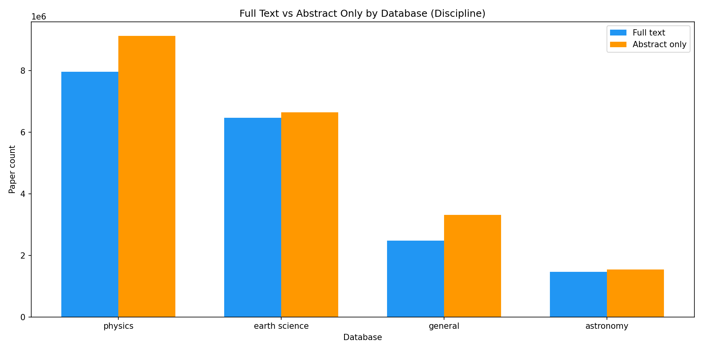

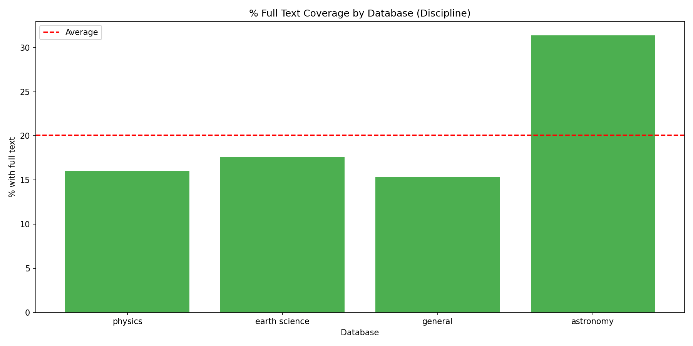

## Citation Count Distribution

| Citations | Total | Full Text | Abstract Only | % Full Text |
|---|---:|---:|---:|---:|
| 0 | 15,058,538 | 5,722,380 | 9,336,158 | 38.0% |
| 1-5 | 8,098,510 | 4,004,849 | 4,093,661 | 49.5% |
| 6-20 | 5,574,339 | 2,991,516 | 2,582,823 | 53.7% |
| 21-100 | 3,171,895 | 1,908,531 | 1,263,364 | 60.2% |
| 101-500 | 461,077 | 290,885 | 170,192 | 63.1% |
| 500+ | 34,691 | 21,879 | 12,812 | 63.1% |

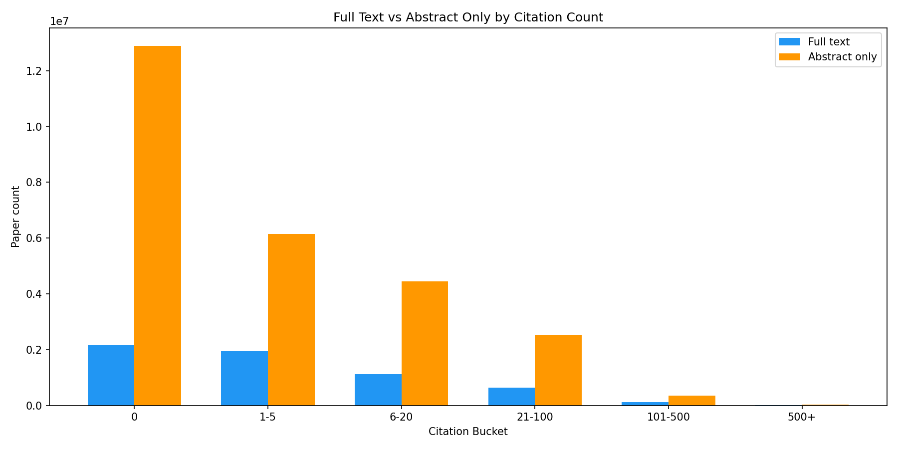

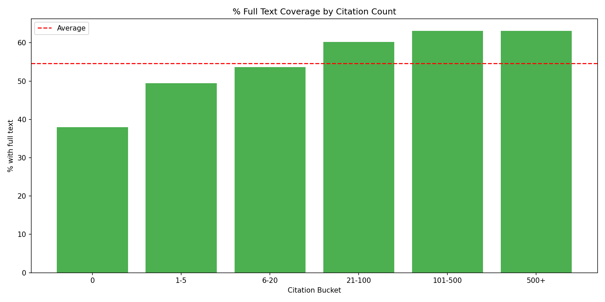

## Journal Distribution (Top 20)

| Journal | Total | Full Text | Abstract Only | % Full Text |
|---|---:|---:|---:|---:|
| arXiv e-prints | 1,526,887 | 1,506,534 | 20,353 | 98.7% |
| NSF Award | 419,382 | 0 | 419,382 | 0.0% |
| Nature | 410,979 | 77,029 | 333,950 | 18.7% |
| AGU Fall Meeting Abstracts | 409,959 | 31 | 409,928 | 0.0% |
| PLoS ONE | 306,926 | 2,251 | 304,675 | 0.7% |
| Scientific Reports | 230,156 | 228,709 | 1,447 | 99.4% |
| Ph.D. Thesis | 219,343 | 1,883 | 217,460 | 0.9% |
| EGU General Assembly Conference Abstracts | 219,147 | 69 | 219,078 | 0.0% |
| Science | 218,460 | 1,564 | 216,896 | 0.7% |
| Physical Review B | 218,152 | 218,004 | 148 | 99.9% |
| APS March Meeting Abstracts | 210,083 | 0 | 210,083 | 0.0% |
| Journal of the American Chemical Society | 209,655 | 407 | 209,248 | 0.2% |
| Journal of Physics Conference Series | 190,833 | 135,367 | 55,466 | 70.9% |
| Acoustical Society of America Journal | 169,728 | 355 | 169,373 | 0.2% |
| Proceedings of the National Academy of Science | 163,776 | 2,654 | 161,122 | 1.6% |
| Journal of Applied Physics | 149,398 | 63,075 | 86,323 | 42.2% |
| Journal of Chemical Physics | 146,719 | 47,507 | 99,212 | 32.4% |
| Physical Review Letters | 138,842 | 138,710 | 132 | 99.9% |
| The Astrophysical Journal | 137,613 | 137,515 | 98 | 99.9% |
| Applied Physics Letters | 135,563 | 79,337 | 56,226 | 58.5% |

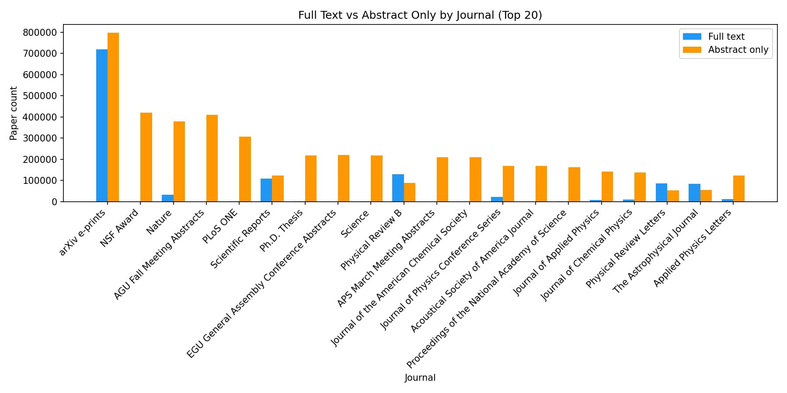

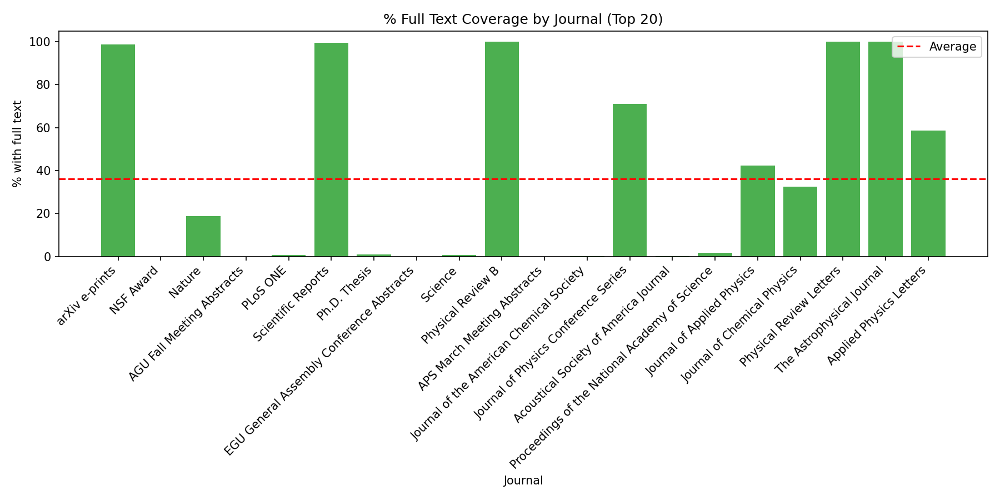

<!-- agent-guidance:start -->

## Agent guidance: safe vs unsafe queries on the full-text cohort

_Generated 2026-04-25T19:09:09+00:00 by `scripts/report_full_text_coverage_bias.py` against `synthetic://dry-run`._

Corpus total: **32,395,000** papers; full-text cohort: **14,912,000** (46.03%).

Full machine-readable distribution (per-row P, Q, KL contribution) is at `/tmp/cb_test.json`.

### KL-divergence per facet (P=full-text, Q=corpus prior)

- arxiv_class: KL = 0.0000 nats (4 rows)
- year: KL = 0.0651 nats (5 rows)
- citation_bucket: KL = 0.0151 nats (6 rows)
- bibstem: KL = 0.8653 nats (5 rows)
- community_semantic_medium: KL = 0.2920 nats (3 rows)

### Safe queries to restrict to the full-text cohort

1. arxiv_class='astro-ph.SR' queries — 99.2% full-text coverage; restricting to the body-bearing cohort barely changes the population (ratio P/Q = 1.0058).
2. year=2025 queries — 77.2% full-text coverage; safe to filter on body IS NOT NULL without losing representativeness.
3. citation_count bucket '101-500' — 63.0% full-text coverage; high-impact papers are over-represented in the full-text cohort but the absolute coverage is high enough to be safe.

### Unsafe queries (filtering to full-text would bias the result)

1. year=1950 (and earlier) — 13.4% full-text coverage; the body-bearing subset is a non-random sample of the historical literature, so restricting to it under-counts pre-modern work.
2. bibstem='AGUFM' (e.g. conference-abstract series) — only 0.0% have body text; full-text filtering would silently drop the entire venue.
3. citation_count bucket '0' (uncited / lightly cited papers) — only 38.0% have body text; long-tail discovery queries should NOT restrict to the full-text cohort.

### Operational rule of thumb

Any MCP tool path that consumes body-text (NER, negative-results, claim extraction) MUST attach a `coverage_note` referencing this report so downstream agents do not over-generalise from the biased subset.

<!-- agent-guidance:end -->
